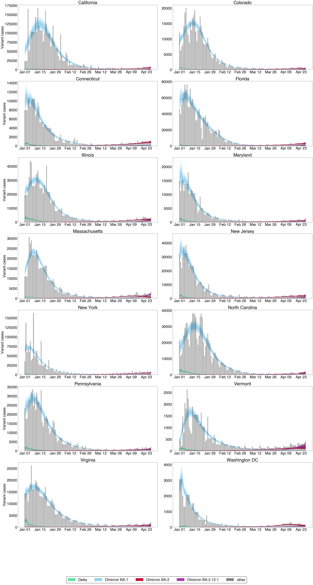
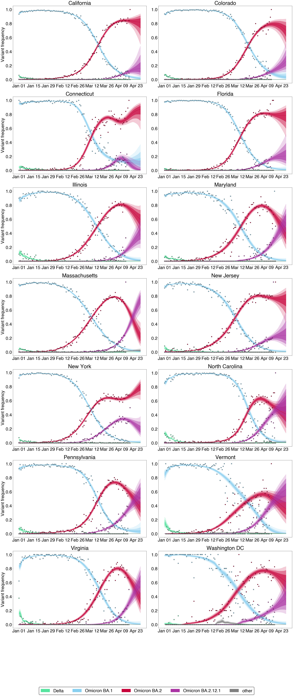
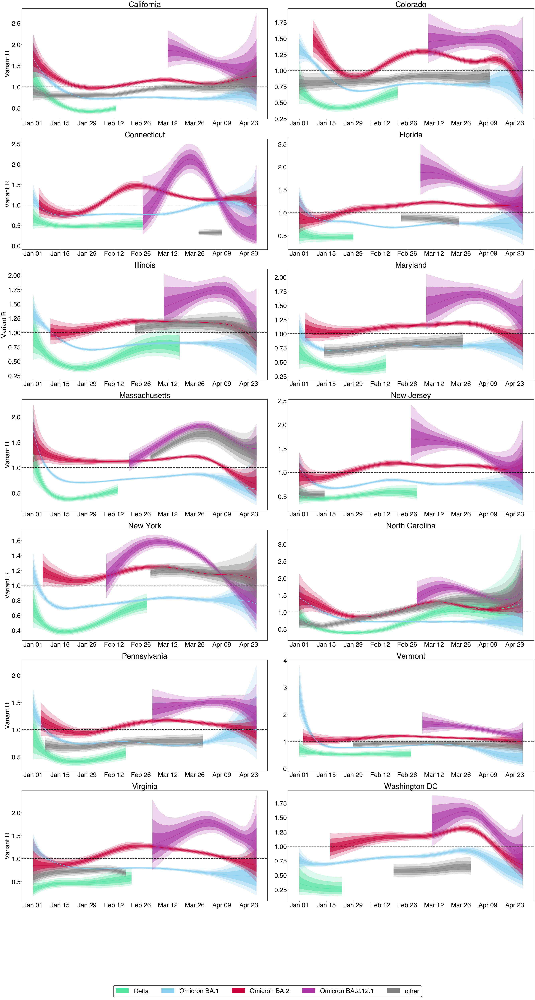
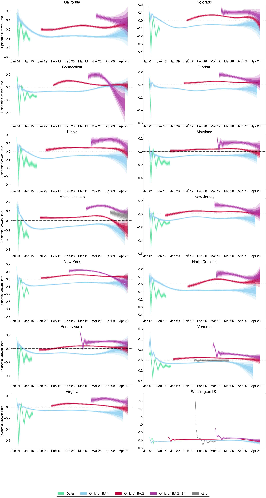

# Estimates for Omicron across US states

## Growth advantage random walk (GARW) $R_{t}$ model

All projections are 7-day projections assuming no change in underlying growth rates. Projection period begins with gray dotted line.

### Case estimates and projections

This figure shows posterior variant-specific incidence obtained from our GARW model. 

### Variant frequencies and projections

This shows the posterior variant frequencies obtained from our GARW model.

### Effective reproduction number estimates and projections

This figure shows the posterior effective reproduction number by variant.

### Epidemic growth rate estimates and projections

This figure shows the posterior epidemic growth rate assuming exponential growth.

## Updating

To update these results, please run the notebook `../../notebook/omicron-us-ba2.12.1`.
