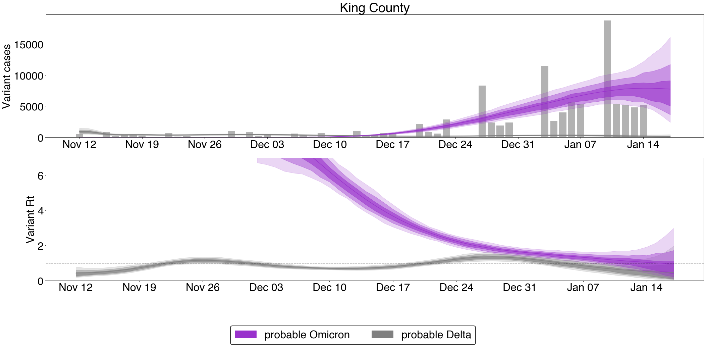
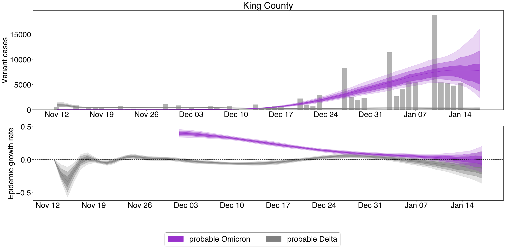

# Estimates for King County SGTF data

## Growth advantage random walk (GARW) $R_{t}$ model

### Variant frequencies

This shows the posterior variant frequencies obtained from our GARW $R_{t}$ model. 

### Effective reproduction number estimates

This figure shows posterior smoothed cases as well as the effective reproduction number by variant.

### Epidemic growth rate estimates

This figure shows the posterior smooth cases as well as the epidemic growth rate as based on the posterior effective reproduction number and assumed generation time.

## Updating

To update these results, please run the notebook `../../notebook/sgtf-king-county`.
