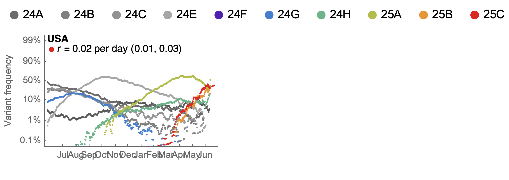
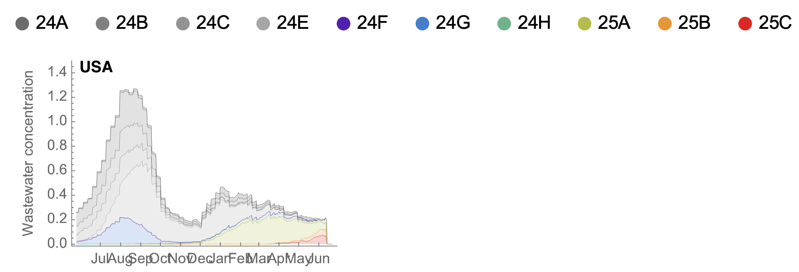
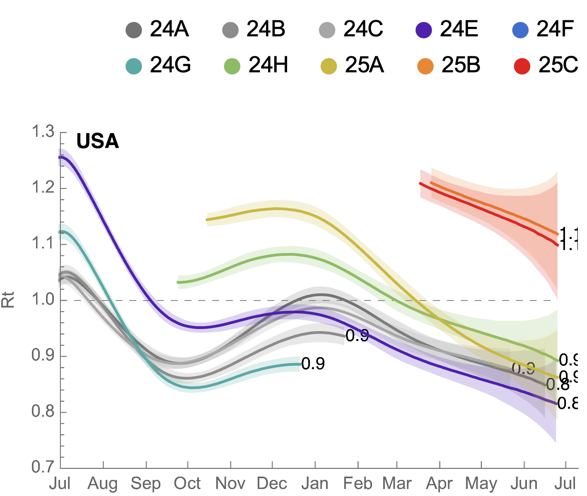
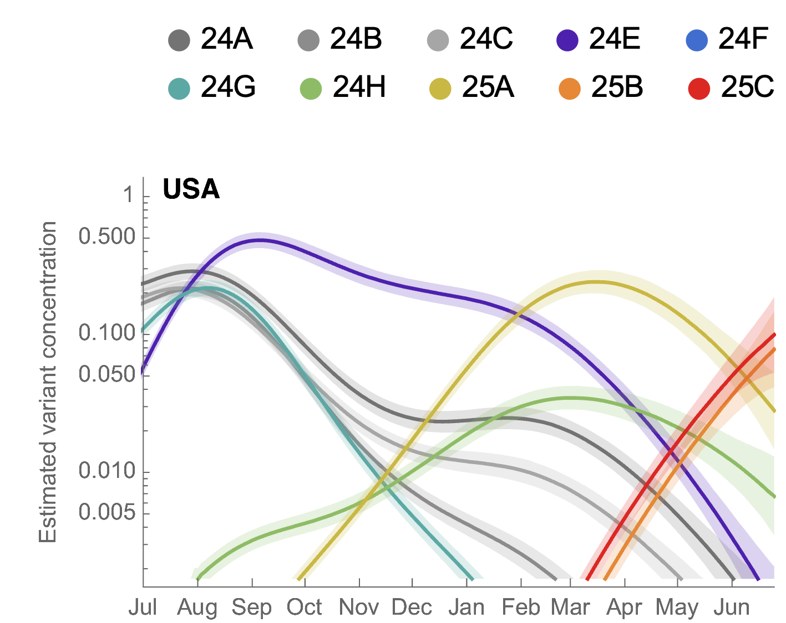
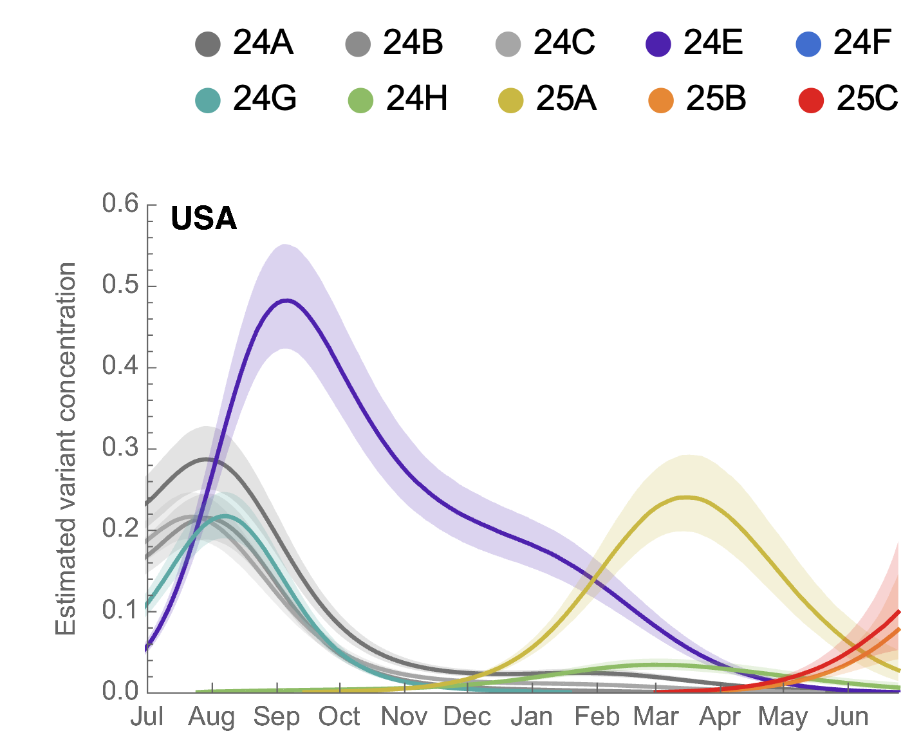
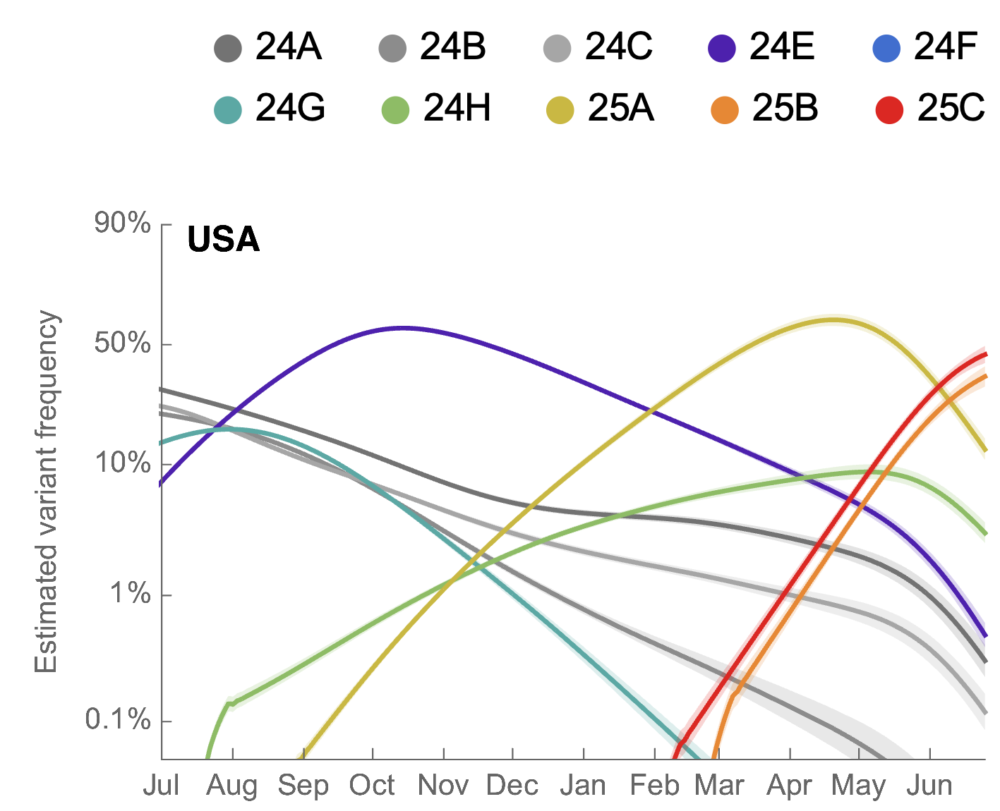

# Results for clades using wastewater prevalence

## Variant frequencies

This shows 7-day smoothed variant frequencies. This includes a logistic growth rate from regression of logit transformed Omicron frequencies.

#### Variant frequencies on logit y axis

## Partitioning case counts by variant

This uses 7-day smoothed daily case counts alongside 7-day smoothed variant frequencies to partition into variant-specific case counts.

#### Stacked variant case counts on natural y-axis

## Model outputs

These outputs are using the growth advantage random walk (GARW) model.

#### Variant-specific growth rate

##### Reproductive number _Rt_

#### Variant-specific daily case counts

##### Log y axis

##### Natural y axis

#### Variant-specific frequencies

