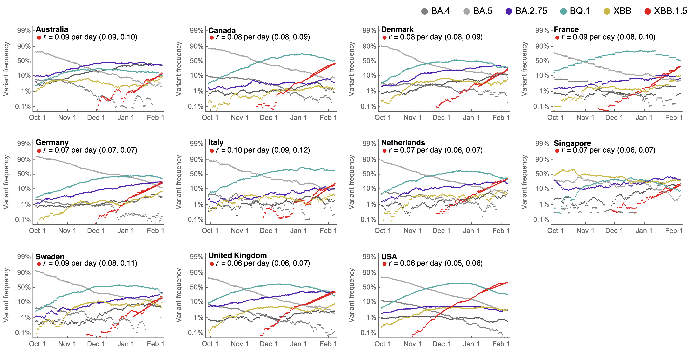
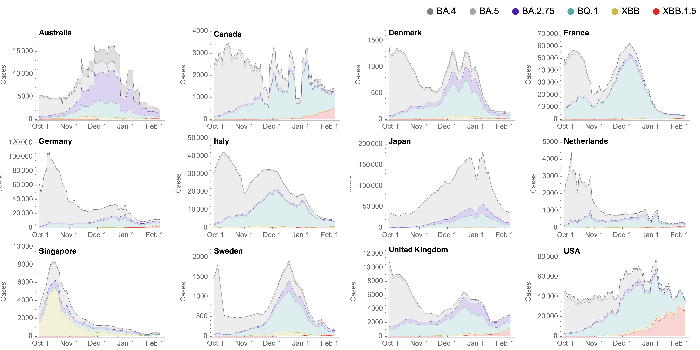
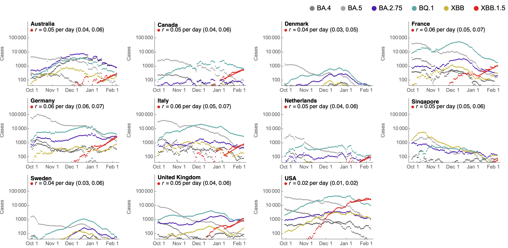
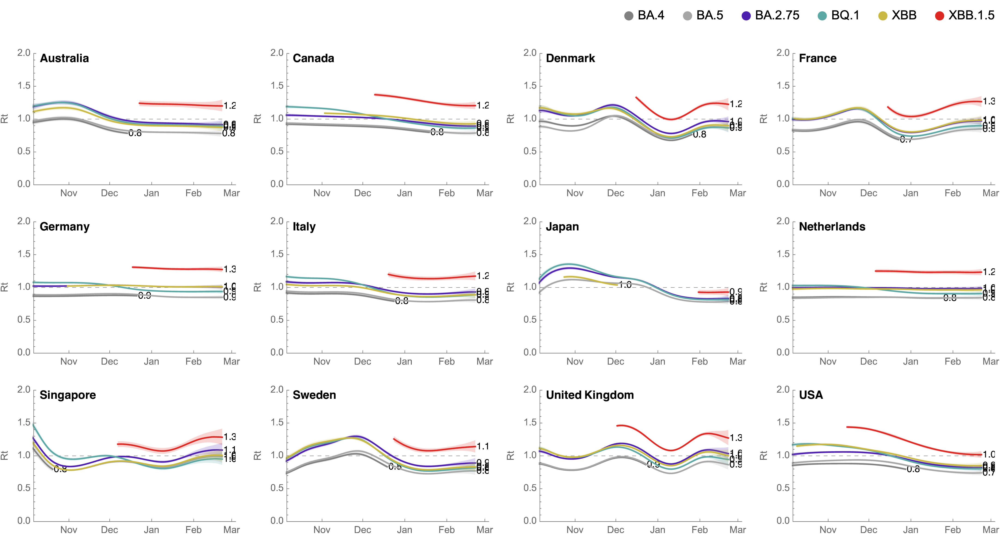
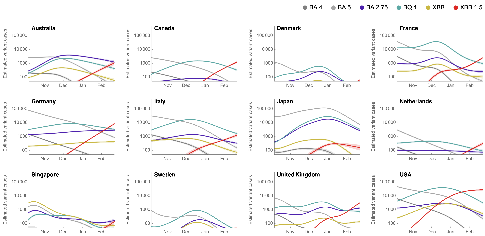
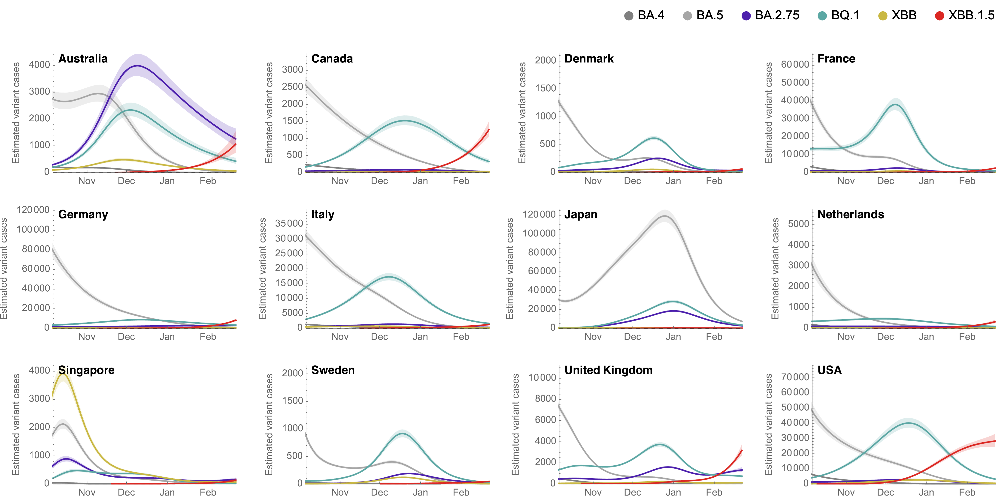

# Results for Omicron across countries splitting out Omicron sublineages / subclades: BA.2 / 21L, BA.4 / 22A, BA.5 / 22B, BA.2.12.1 / 22C, BA.2.75 / 22D, BQ.1 / 22E, XBB / 22F

## Variant frequencies

This shows 7-day smoothed variant frequencies. This includes a logistic growth rate from regression of logit transformed Omicron frequencies.

#### Variant frequencies on logit y axis

##### Focus on lineage BQ.1 / clade 22E

## Partitioning case counts by variant

This uses 7-day smoothed daily case counts alongside 7-day smoothed variant frequencies to partition into variant-specific case counts.

#### Stacked variant case counts on natural y-axis

#### Variant case counts on log y-axis

##### Focus on lineage BQ.1 / clade 22E

## Model outputs

These outputs are using the growth advantage random walk (GARW) model.

#### Variant-specific growth rate

##### Reproductive number _Rt_

#### Variant-specific daily case counts

##### Log y axis

##### Natural y axis

#### Variant-specific frequencies

