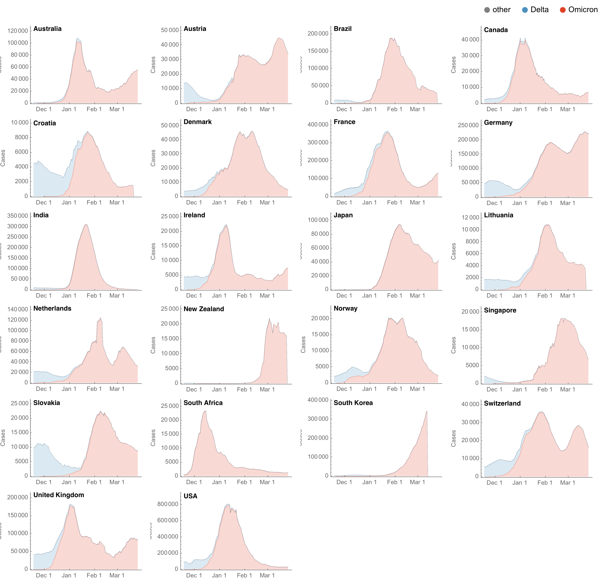
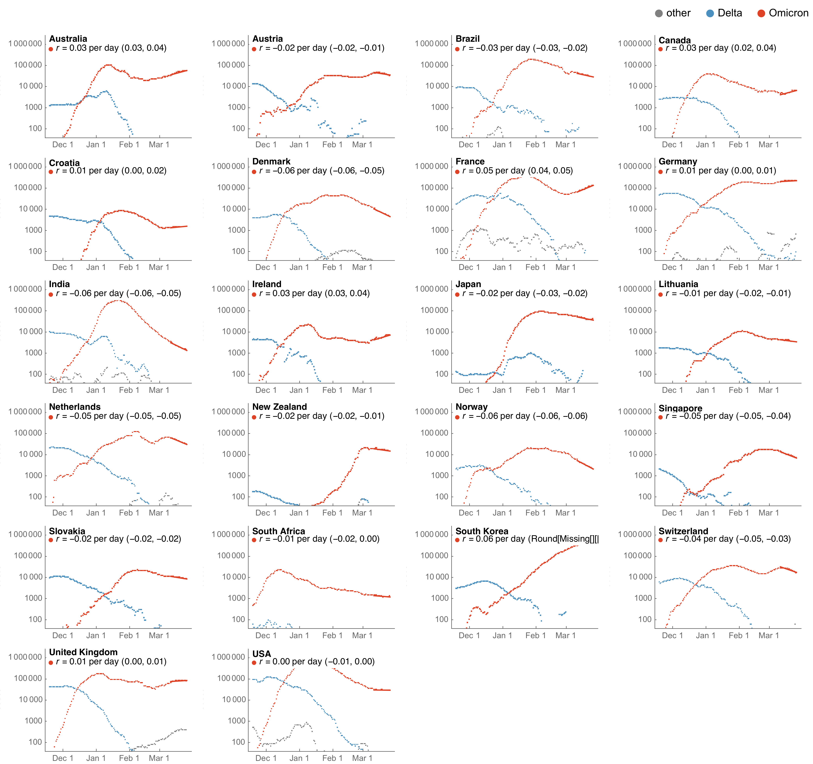

# Results for Omicron across countries

## Partitioning case counts by variant across countries

### Stream plot on natural y-axis

### Line plot on log y-axis

## Updating

These results can be updated via:

1. Running the notebook `omicron-countries-plotting.nb` that will update figures in `figures/` that are referenced above using data in `../../data/`.
