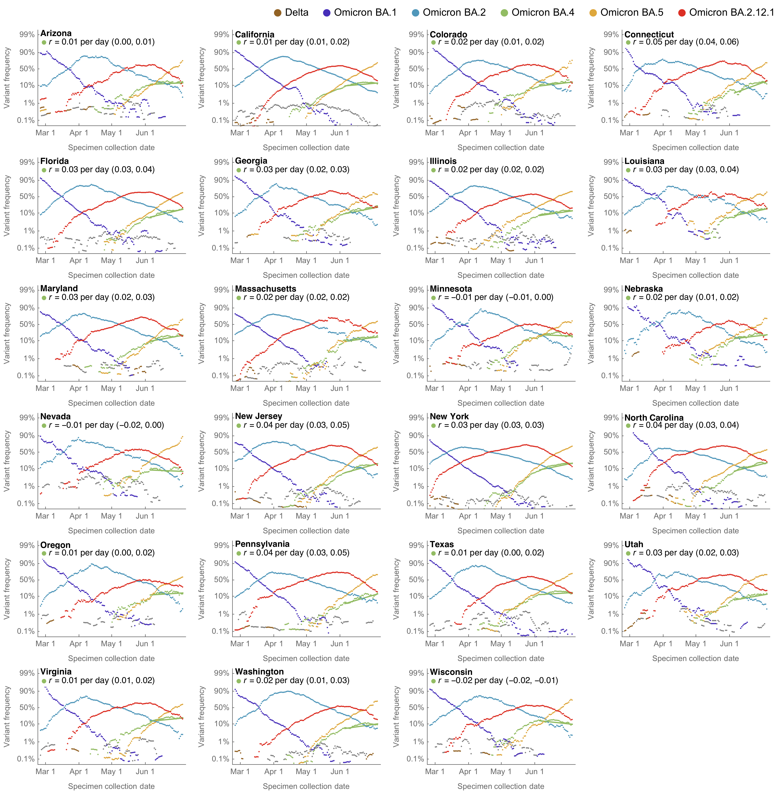
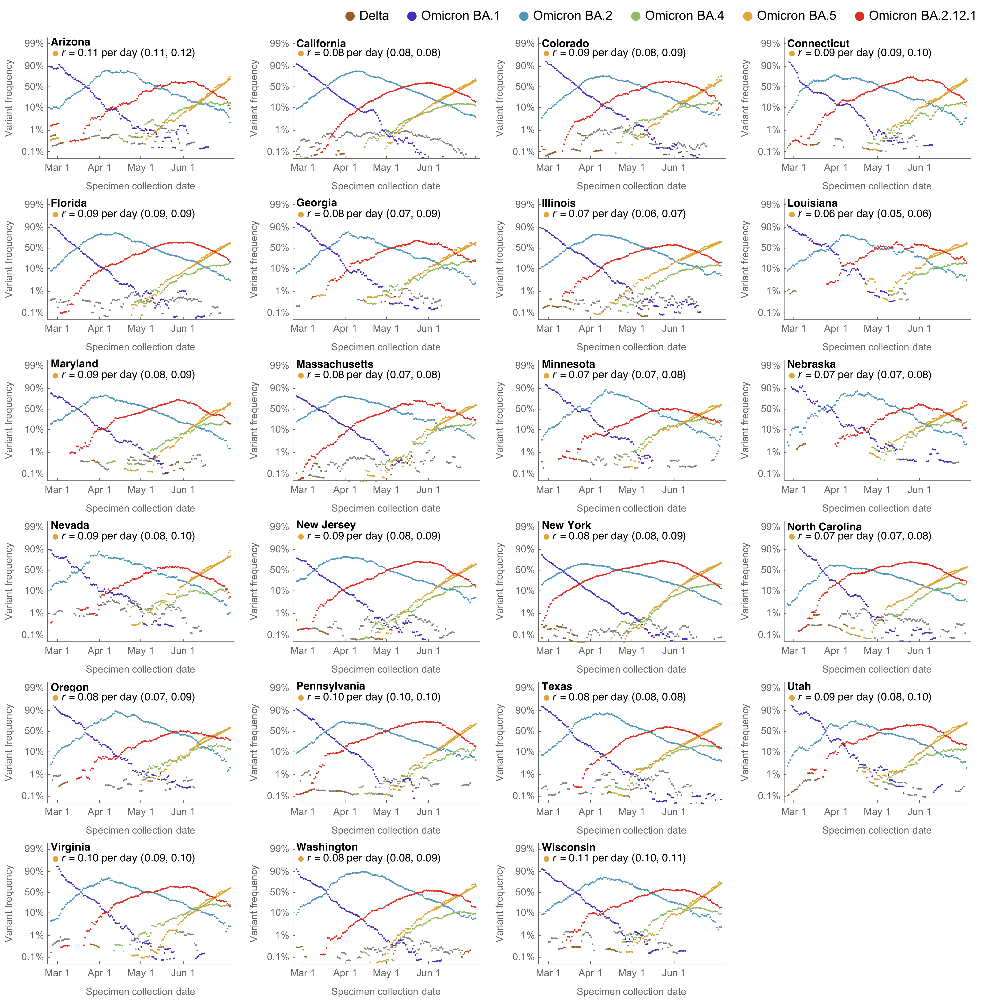
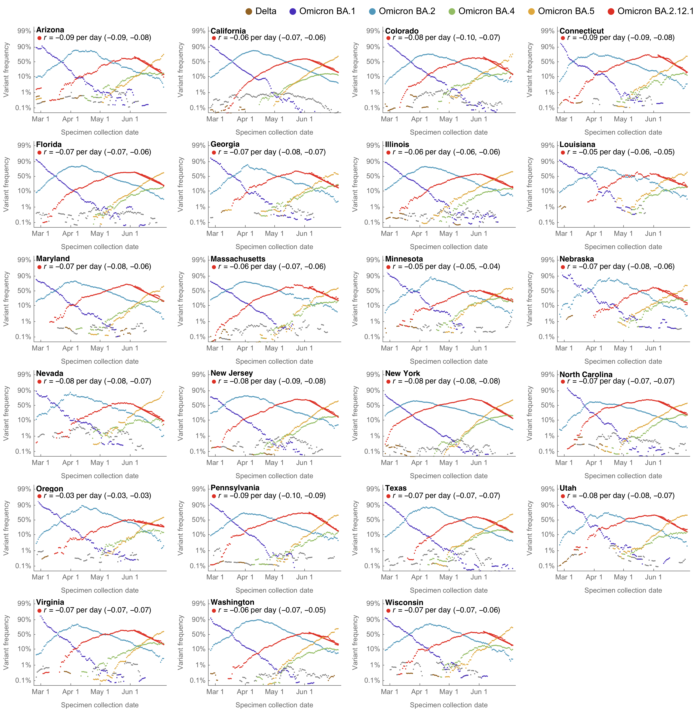
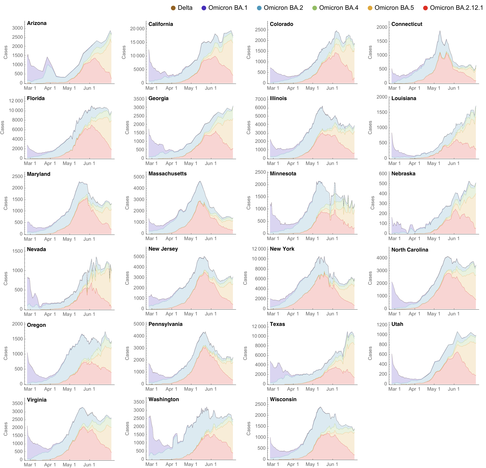
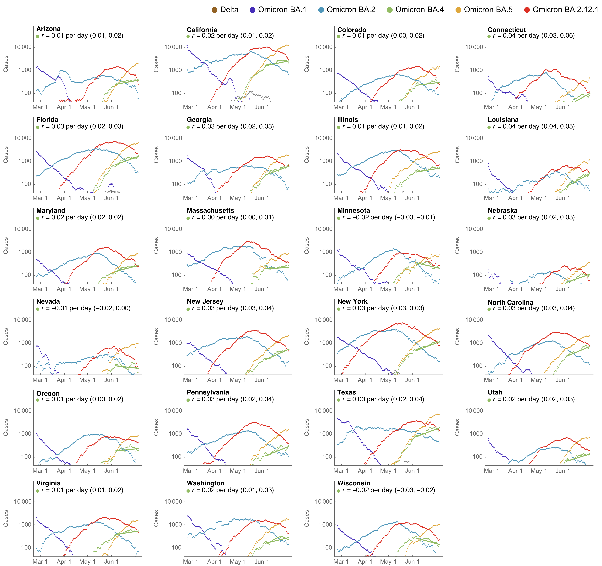
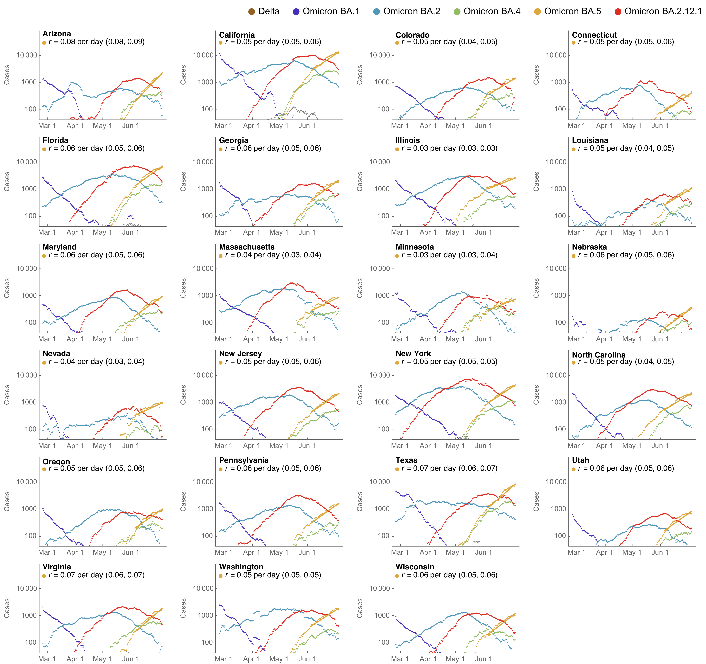
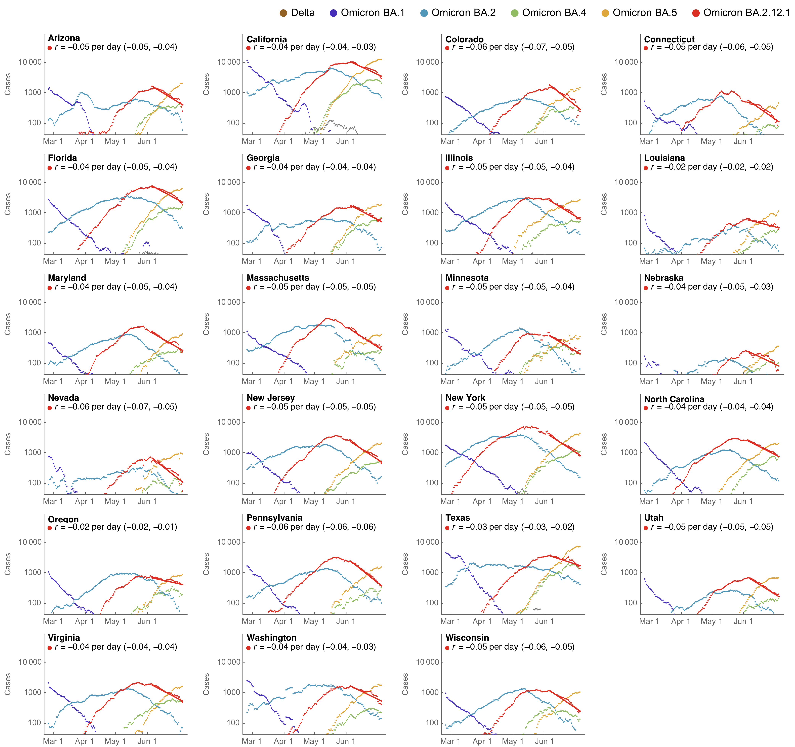
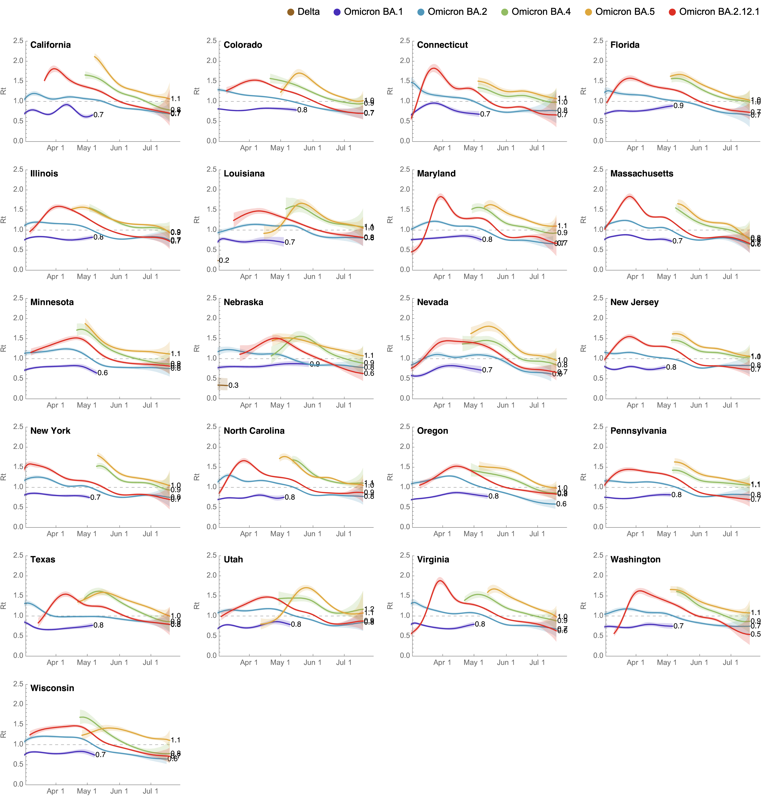
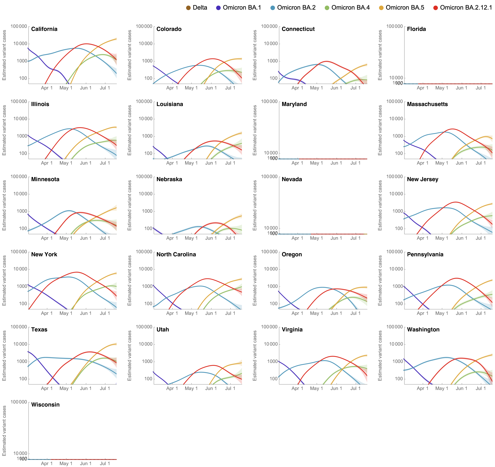
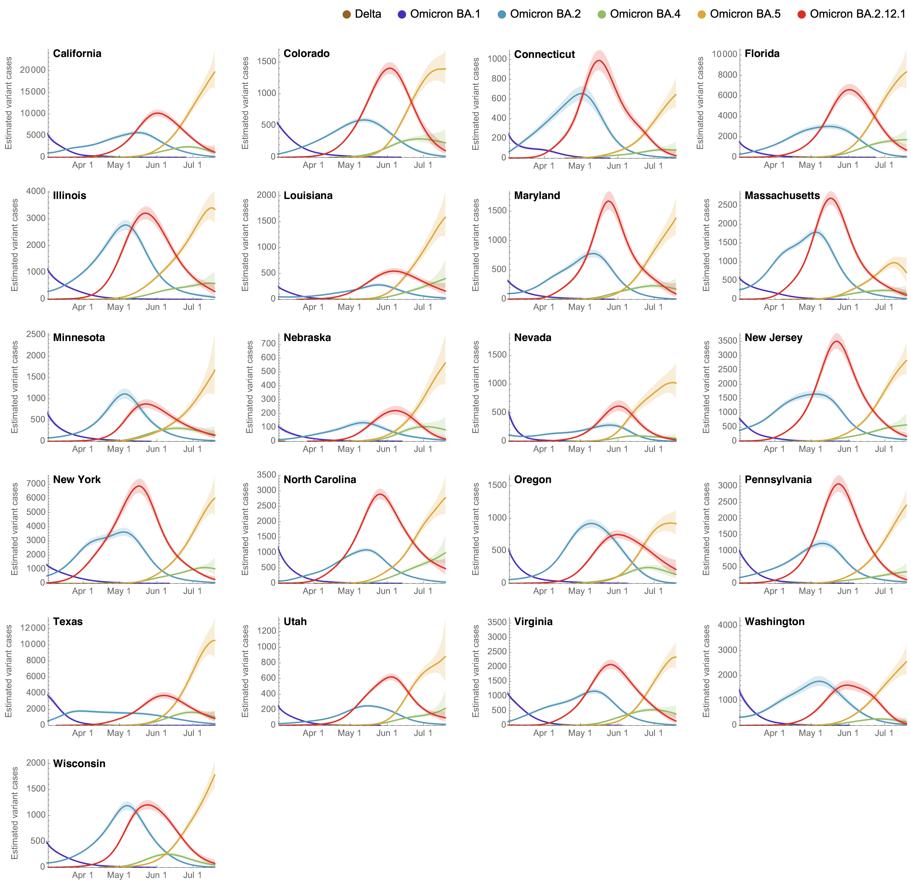

# Results for Omicron across US states splitting out Omicron sublineages / subclades: BA.1 / 21K, BA.2 / 21L, BA.4 / 22A, BA.5 / 22B, BA.2.12.1 / 22C

#### Variant frequencies on logit y axis

##### Focus on lineage BA.4 / clade 22A

##### Focus on lineage BA.5 / clade 22B

##### Focus on lineage BA.2.12.1 / clade 22C

## Partitioning case counts by variant

This uses 7-day smoothed daily case counts alongside 7-day smoothed variant frequencies to partition into variant-specific case counts.

#### Stacked variant case counts on natural y-axis

#### Variant case counts on log y-axis

This includes estimate of _r_ from regression of logged Omicron case counts.

##### Focus on lineage BA.4 / clade 22A

##### Focus on lineage BA.5 / clade 22B

##### Focus on lineage BA.2.12.1 / clade 22C

## Model outputs

These outputs are using the growth advantage random walk (GARW) model.

#### Variant-specific growth rate

##### Reproductive number _Rt_

#### Variant-specific daily case counts

##### Log y axis

##### Natural y axis

#### Variant-specific frequencies

## Updating

These results can be updated via:

1. Running the notebook `omicron-us-split-plotting.nb` that will update figures in `figures/` that are referenced above using data in `../../data/`.
