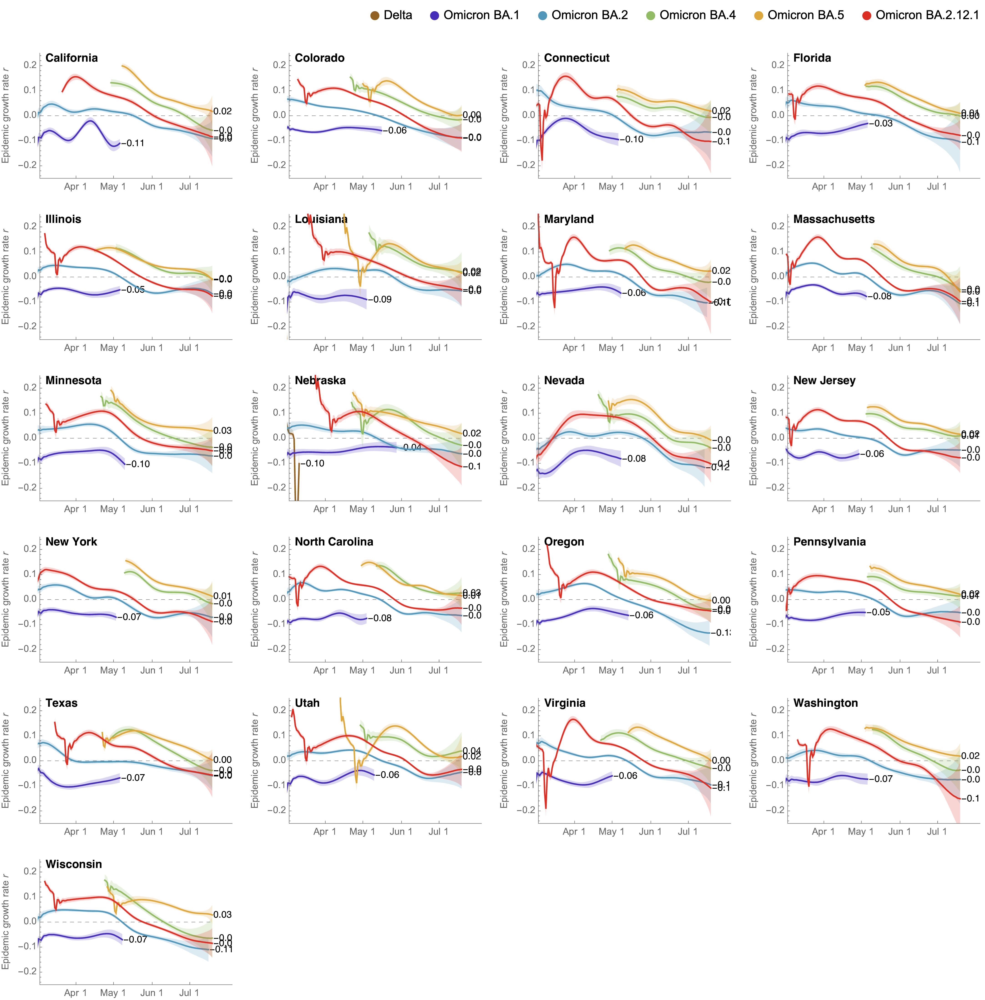
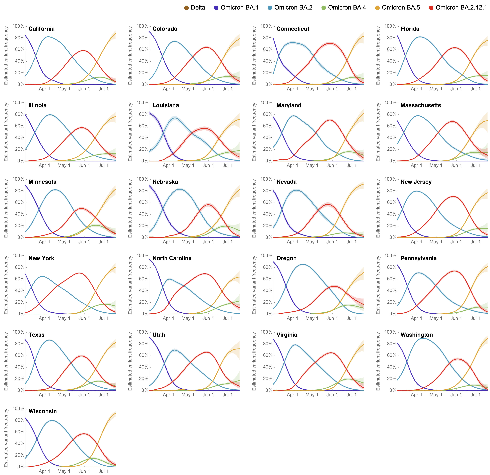
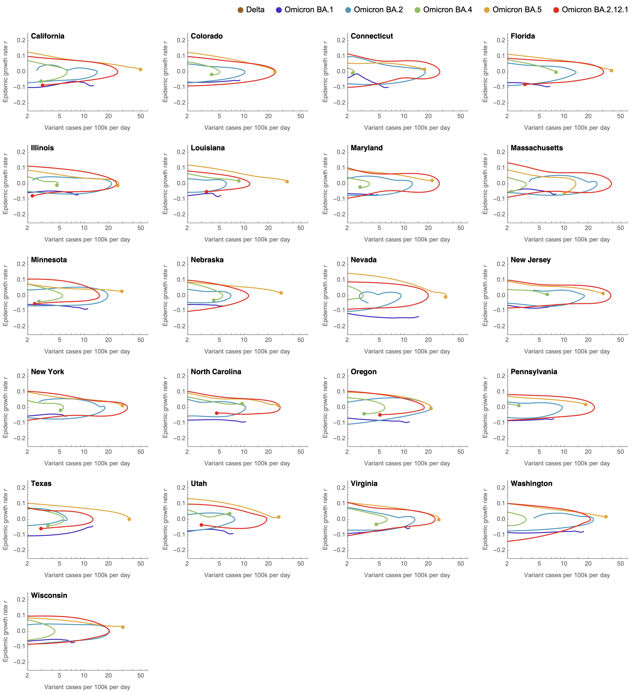

# Results for Omicron across US states splitting out lineage BA.1 / clade 21K from lineage BA.2 / clade 21L

## Variant frequencies

This shows 7-day smoothed variant frequencies. This includes a logistic growth rate from regression of logit transformed Omicron frequencies.

#### Variant frequencies on natural y axis

#### Variant frequencies on logit y axis

## Partitioning case counts by variant

This uses 7-day smoothed daily case counts alongside 7-day smoothed variant frequencies to partition into variant-specific case counts.

#### Stacked variant case counts on natural y-axis

#### Variant case counts on log y-axis

This includes estimate of _r_ from regression of logged Omicron case counts.

## Model outputs

These outputs are using the growth advantage random walk (GARW) model.

#### Variant-specific growth rate

##### Epidemic growth rate _r_ per day

##### Reproductive number _Rt_

#### Variant-specific daily case counts

##### Log y axis

##### Natural y axis

#### Variant-specific frequencies

#### Phase plots of epidemic growth rate vs per-capita incidence

## Updating

These results can be updated via:

1. Running the notebook `omicron-us-split-plotting.nb` that will update figures in `figures/` that are referenced above using data in `../../data/`.
