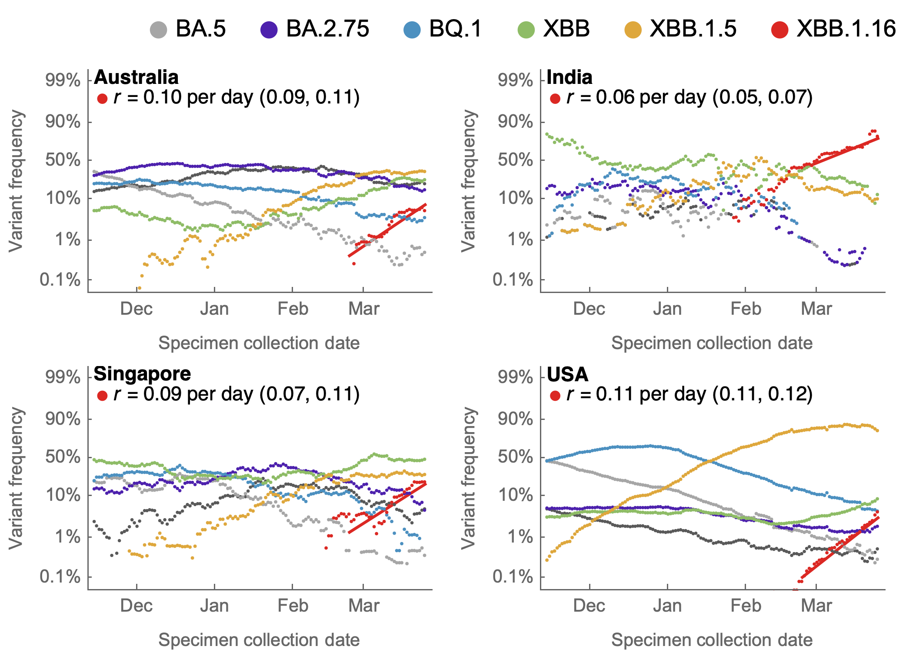
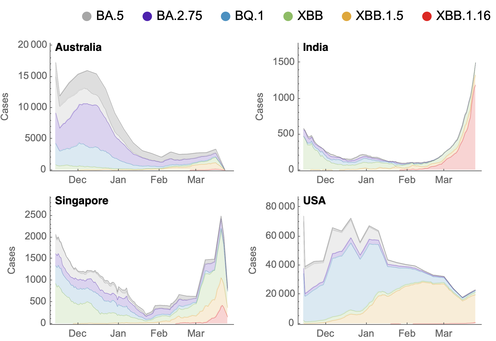
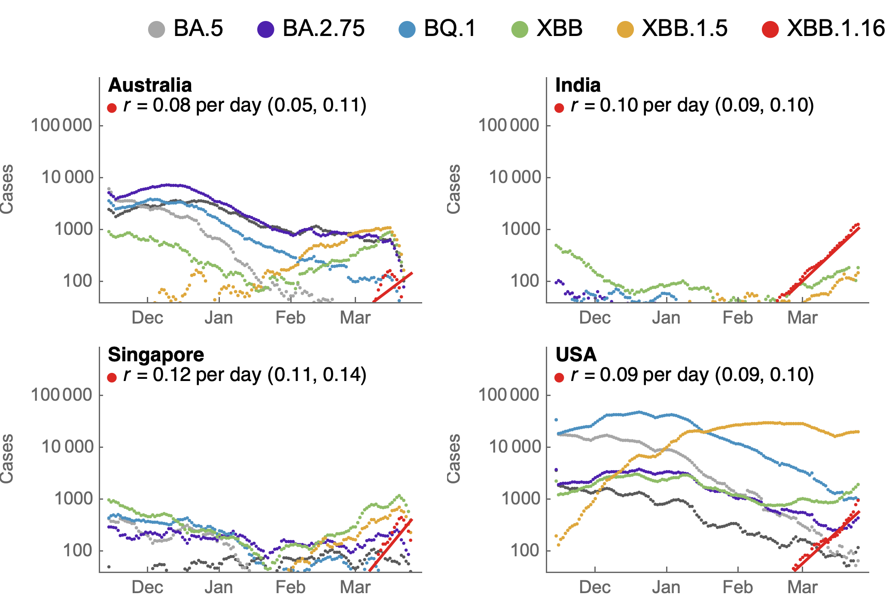

# Results for Omicron across countries splitting out lineages XBB.1.16

## Variant frequencies

This shows 7-day smoothed variant frequencies. This includes a logistic growth rate from regression of logit transformed Omicron frequencies.

#### Variant frequencies on logit y axis

This includes estimate of _r_ from regression of logit Omicron XBB.1.16 frequencies.

## Partitioning case counts by variant

This uses 7-day smoothed daily case counts alongside 7-day smoothed variant frequencies to partition into variant-specific case counts.

#### Stacked variant case counts on natural y-axis

#### Variant case counts on log y-axis

This includes estimate of _r_ from regression of logged Omicron XBB.1.16 case counts.

## Updating

These results can be updated via:

1. Running the notebook `omicron-xbb116-data-plots.nb` that will update figures in `figures/` that are referenced above using data in `../../data/`.
