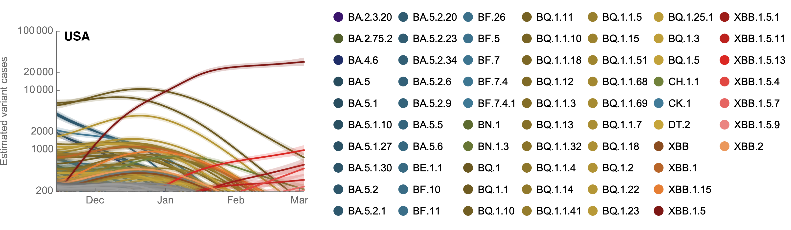
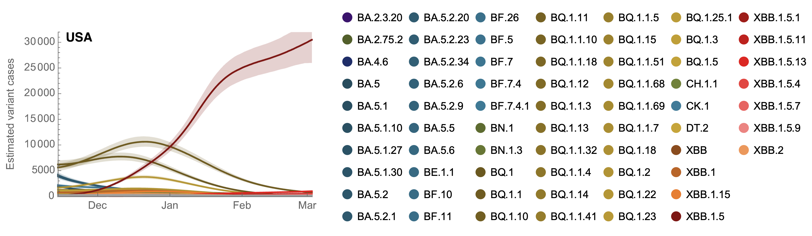
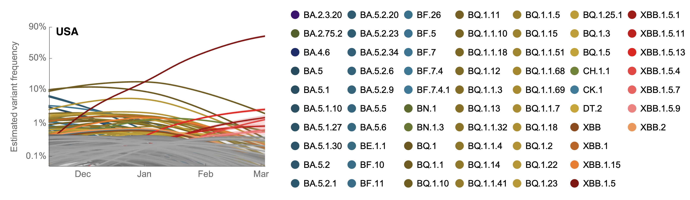

# Frequencies and absolute growth rates for Pango lineages

The following are posterior estimate from the growth advantage random walk (GARW) model that uses sequence counts alongside overall case counts to estimate variant-specific cases and Rt.

##### Reproductive number _Rt_ through time across Pango lineages

##### Reproductive number _Rt_ at present across Pango lineages

##### Reproductive number _Rt_ at present for top 5 fast growing Pango lineages

##### Variant-specific daily case count on log y axis

##### Variant-specific daily case count on natural y axis

#### Variant-specific frequencies

