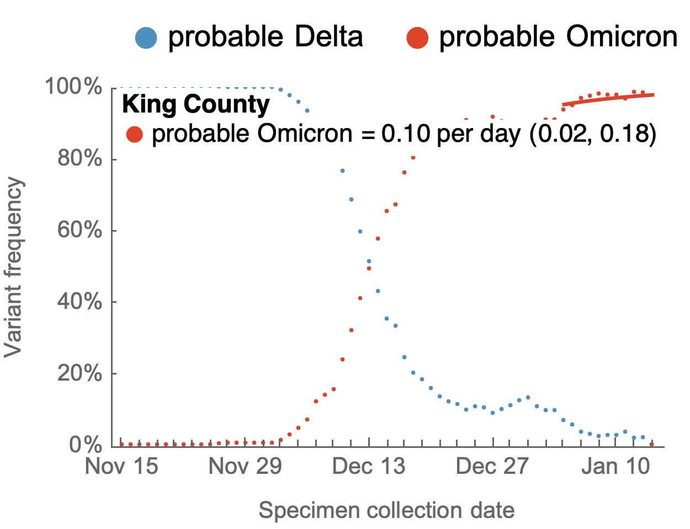
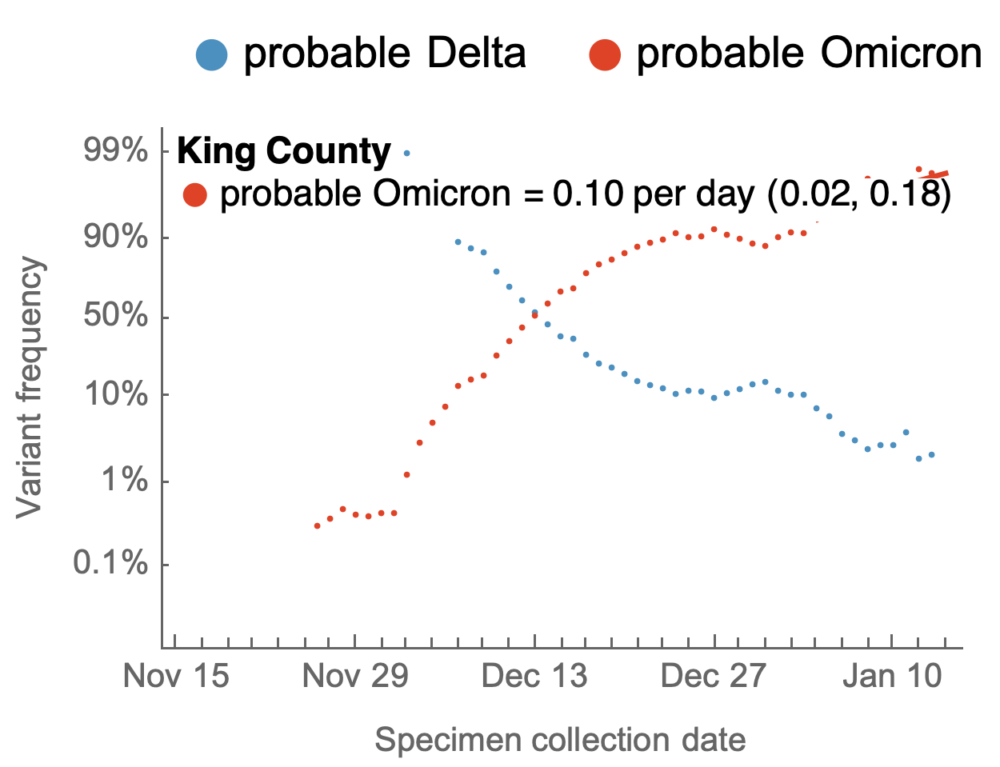
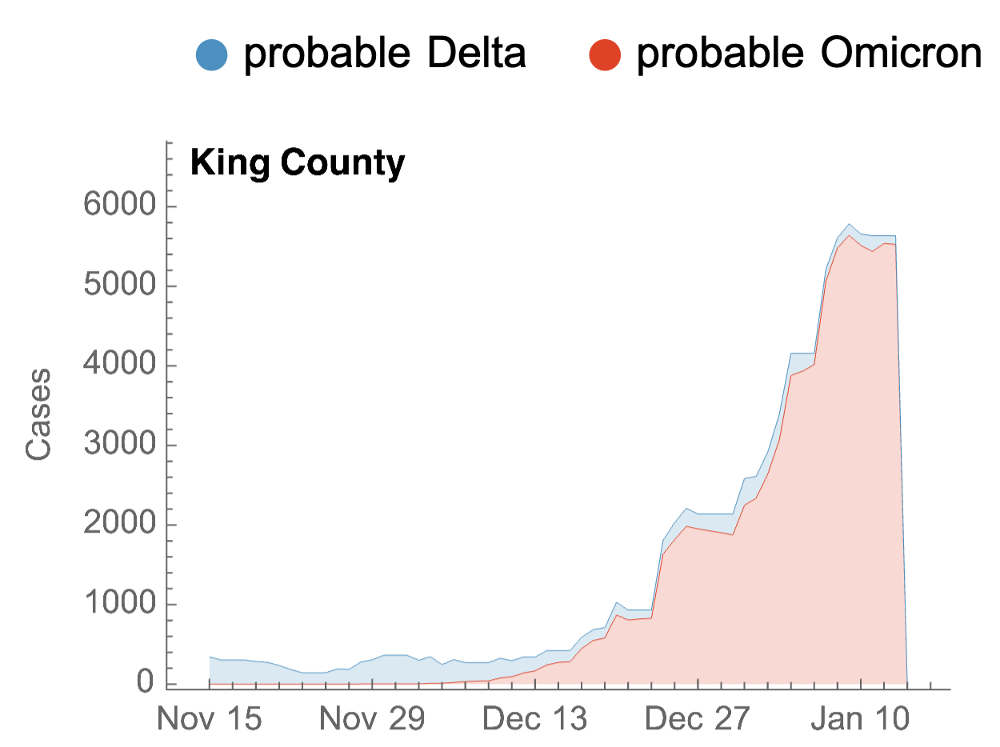
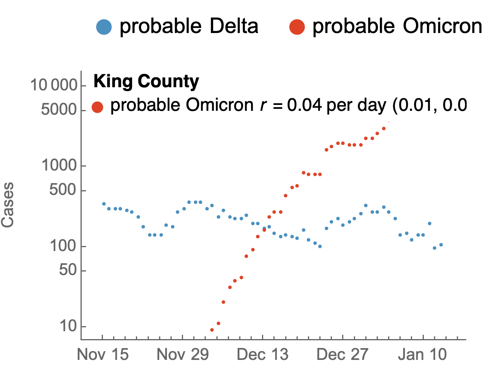
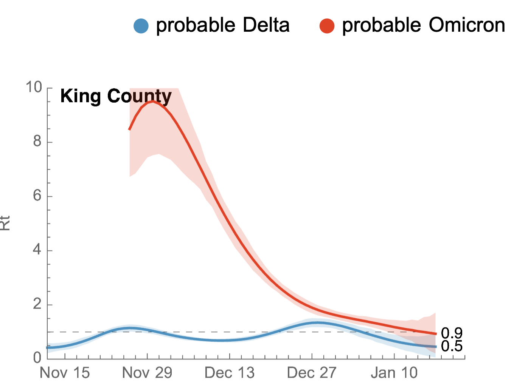
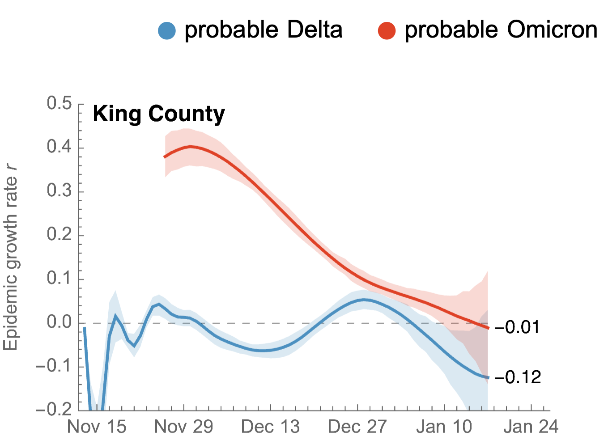
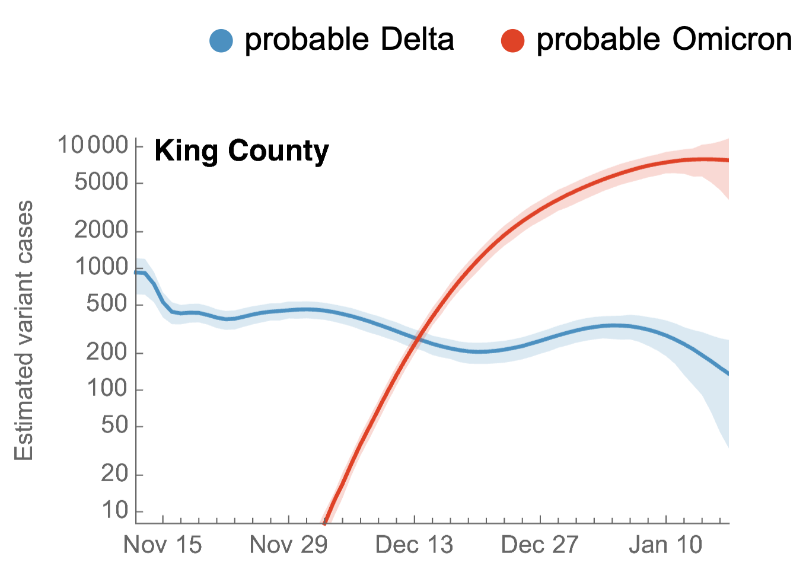
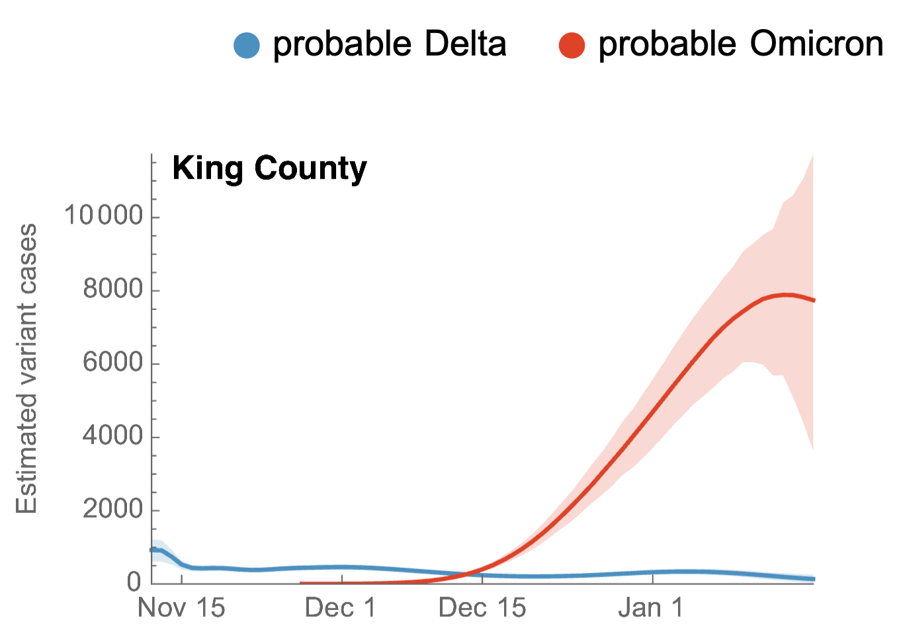

# Results for SGTF in King County

This is using SGTF as a proxy for "probable Omicron". SGTF data from [UW Virology](https://github.com/proychou/sgtf) and Seattle Flu Study.

## Variant frequencies

This shows 7-day smoothed variant frequencies. This includes a logistic growth rate from regression of logit transformed Omicron frequencies.

#### Variant frequencies on natural y axis

#### Variant frequencies on logit y axis

## Partitioning case counts by variant

This uses 7-day smoothed daily case counts alongside 7-day smoothed variant frequencies to partition into variant-specific case counts.

#### Stacked variant case counts on natural y-axis

#### Variant case counts on log y-axis

This includes estimate of _r_ from regression of logged Omicron case counts.

## Model outputs

These outputs are using the "fixed growth" model.

#### Variant-specific Rt

#### Variant-specific epidemic growth rate r

#### Variant-specific daily case counts

#### Log y-axis

#### Natural y-axis

## Updating

These results can be updated via:

1. Running the notebook `sgtf-king-county-plotting.nb` that will update figures in `figures/` that are referenced above using data in `../../data/`.
