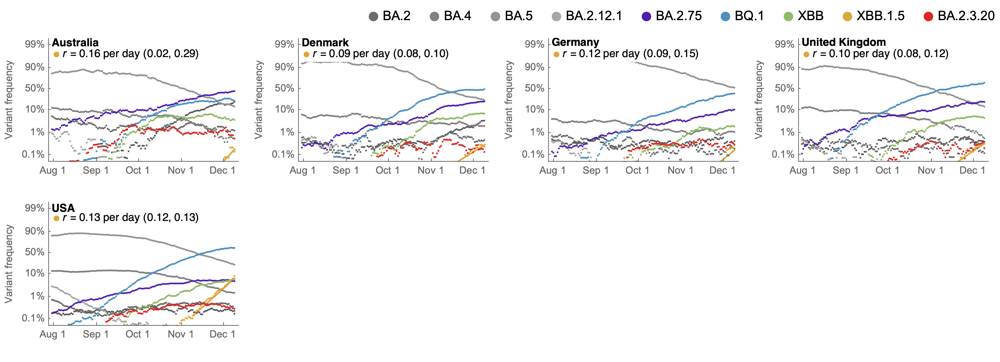
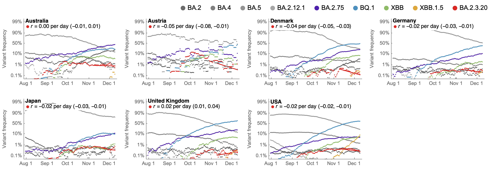
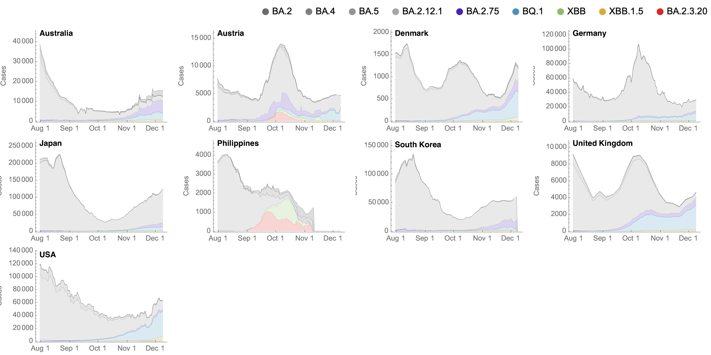
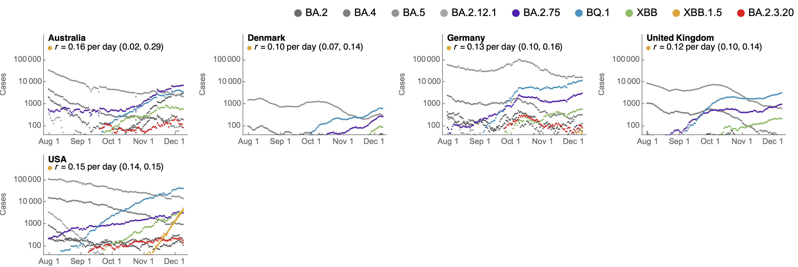
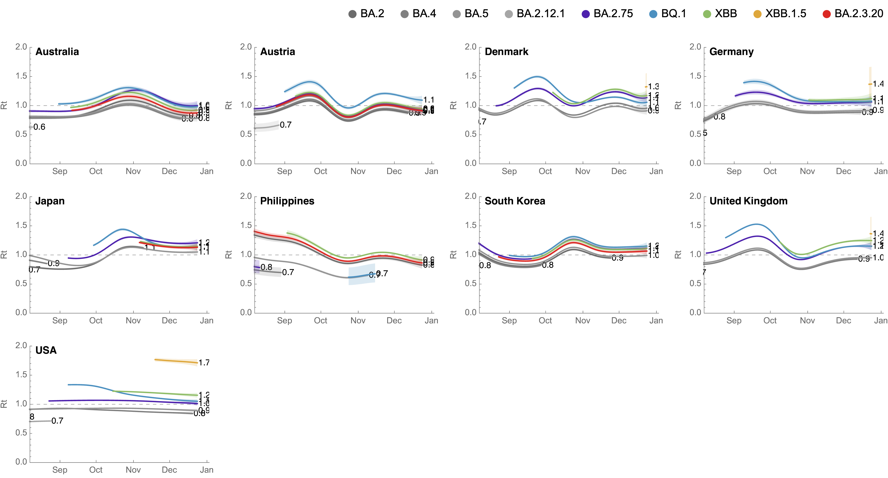
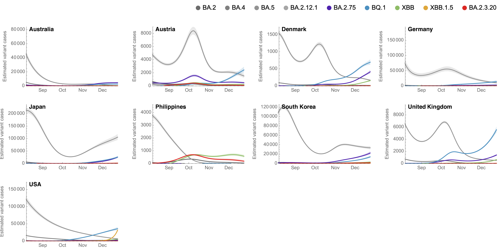
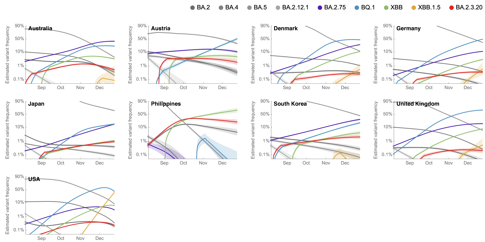

# Results for clades across countries additionally splitting out lineages XBB.1.5 and BA.2.3.20

## Variant frequencies

This shows 7-day smoothed variant frequencies. This includes a logistic growth rate from regression of logit transformed Omicron frequencies.

#### Variant frequencies on logit y axis

##### Focus on lineage XBB.1.5

##### Focus on lineage BA.2.3.20

## Partitioning case counts by variant

This uses 7-day smoothed daily case counts alongside 7-day smoothed variant frequencies to partition into variant-specific case counts.

#### Stacked variant case counts on natural y-axis

#### Variant case counts on log y-axis

##### Focus on lineage XBB.1.5

##### Focus on lineage BA.2.3.20

## Model outputs

These outputs are using the growth advantage random walk (GARW) model.

#### Variant-specific growth rate

##### Reproductive number _Rt_

#### Variant-specific daily case counts

##### Log y axis

##### Natural y axis

#### Variant-specific frequencies

